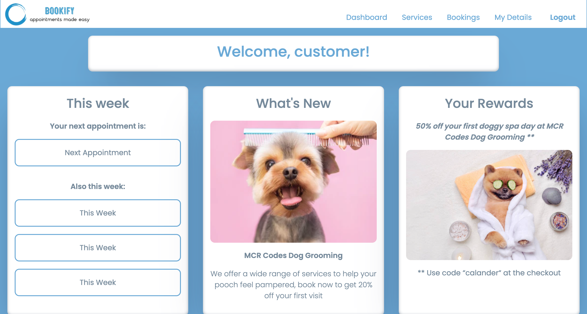
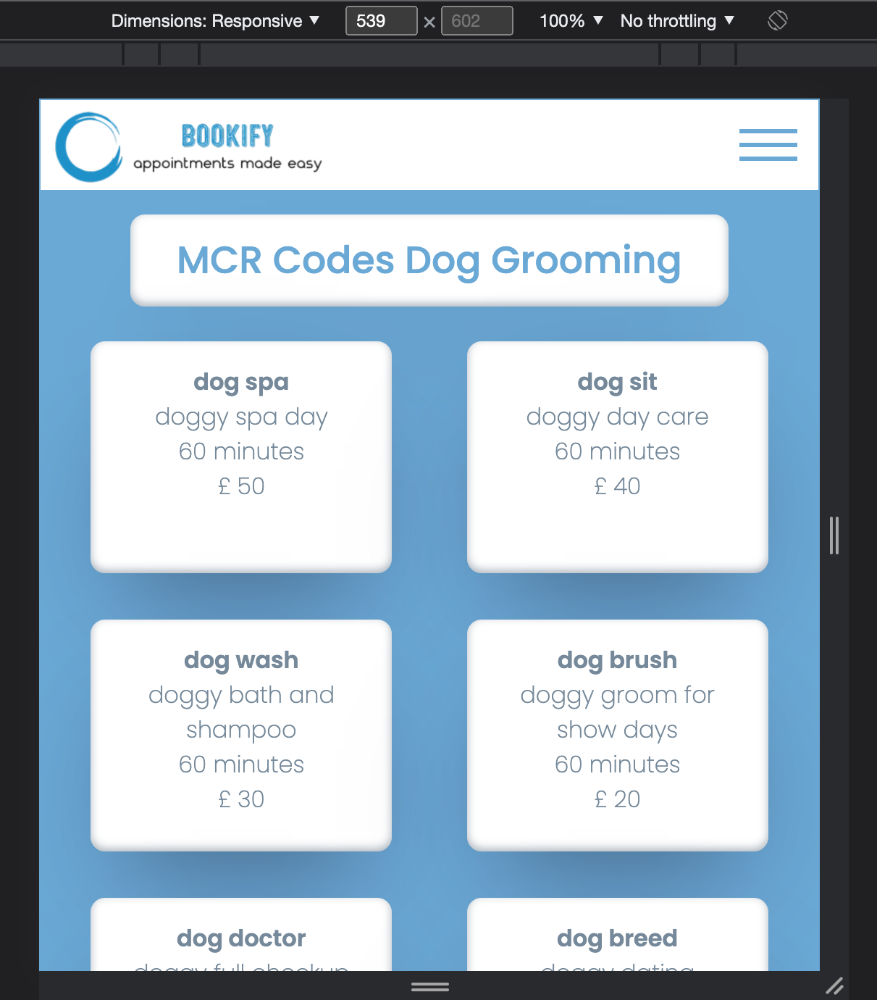

# :calendar: Welcome to Bookify!

Frontend Repo for our Final Project with Manchester Codes, Bookify is an app designed for small businesses to advertise the range of services they have to offer and manage their bookings in a calendar, and for customers to view these services and arrange appointments.

## Tech Stack

HTML CSS JavaScript and React

## Packages Used

- react-scheduler
- axios
- bootstrap
- jwt-decode
- material-ui
- moment
- react-router-dom
- react-icons

## Screenshots

## Getting Started!

You will first need to clone down the back end repo, `git clone https://github.com/invertostew/bookify-backend`. use `cd bookify-backend` to move into this repo and then run `npm install` to install all the depedancies. Follow the instructions on the README.md file this repo to initialise a docker container which will run the PostgreSQL database, and `npm run start:dev` to start the server locally : This must be running on port 3000

Next clone down this repo `git clone https://github.com/Disc0des/bookify` use `cd bookify` then `npm install` again to install the dependacies for the frontend. From here you can run the scripts below.

## Available Scripts

In the project directory, you can run:

### `npm start`

Runs the app in the development mode. Should not be run on localhost:3000

The page will reload when you make changes.
You may also see any lint errors in the console.

### `npm test`

Launches the test runner in the interactive watch mode.

### `npm run build`

Builds the app for production to the `build` folder.

### `npm run eject`

**Note: this is a one-way operation. Once you `eject`, you can't go back!**

If you aren't satisfied with the build tool and configuration choices, you can `eject` at any time. This command will remove the single build dependency from your project.

Instead, it will copy all the configuration files and the transitive dependencies (webpack, Babel, ESLint, etc) right into your project so you have full control over them. All of the commands except `eject` will still work, but they will point to the copied scripts so you can tweak them. At this point you're on your own.

You don't have to ever use `eject`. The curated feature set is suitable for small and middle deployments, and you shouldn't feel obligated to use this feature. However we understand that this tool wouldn't be useful if you couldn't customize it when you are ready for it.

# Authors

Nathan Humphreys
Dan Hembery and
Stuart Green
